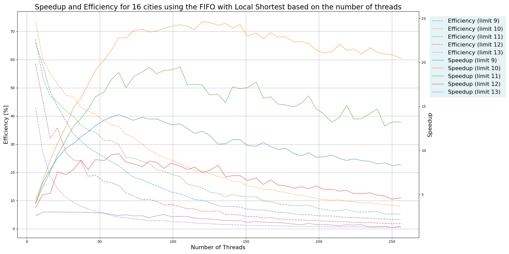
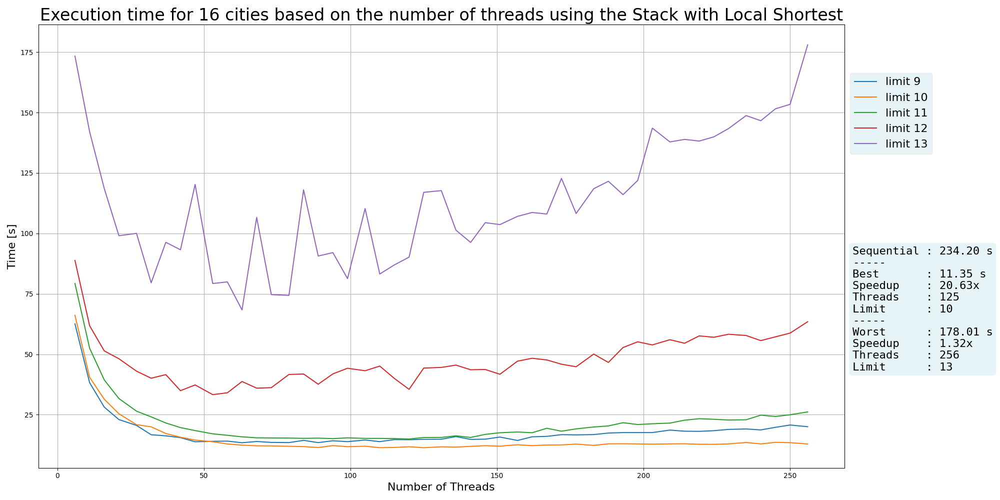
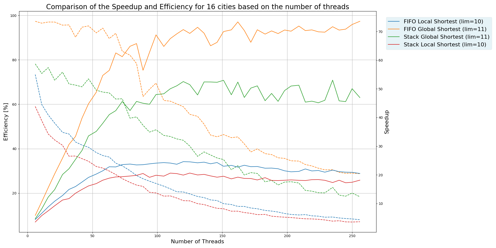

# Projet MA - PCM: Traveling Salesman Problem (TSP)

## Introduction

Le problème du voyageur de commerce (*TSP*) est un défi combinatoire où la complexité croît de manière *factorielle* avec le nombre de villes. Ce projet vise à démontrer une *accélération significative* grâce à la *parallélisation* sur une architecture multicœur (256 cœurs) avec des structures de données *lock-free*.

### Objectifs
- Comparer les performances entre deux approches : *FIFO* et *STACK*.
- Explorer l'impact des limites de subdivision des tâches et du partage des chemins les plus courts (global vs local).

## Implémentations

### Structures de partage
- **FIFO** : Exploration horizontale (moins optimale) mais *lock-free* efficace.
- **STACK** : Exploration verticale (meilleures bounds) mais avec un goulot d'étranglement.

### Stockage du chemin le plus court
- **Global Shortest** : Partagé entre threads. Meilleures performances globales.
- **Local Shortest** : Individuel par thread. Moins de contention mais potentiellement moins efficace.

## Résultats

### Comparaison des implémentations
- **FIFO Global** : Meilleure performance globale avec un *speedup* de **73.59x** (limite 11, 75 threads).
- **STACK Global** : Performances élevées mais inférieures à FIFO avec un *speedup* de **53.05x** (limite 11, 65 threads).
- **Local Shortest** : Moins performants pour les deux structures.

| Méthode        | Meilleur temps (s) | Speedup   | Limite optimale | Threads optimaux |
|----------------|--------------------|-----------|-----------------|------------------|
| Séquentiel     | 234.20            | -         | -               | -                |
| **FIFO Global**| **3.18**          | **73.59x**| 11              | 75               |
| FIFO Local     | 9.52              | 24.61x    | 10              | 35               |
| STACK Global   | 4.41              | 53.05x    | 11              | 65               |
| STACK Local    | 11.35             | 20.63x    | 10              | 40               |

#### FIFO Global Shortest
  
*Graphique du temps d'exécution en fonction du nombre de threads (16 villes)*

  
*Graphique du speedup et de l'efficience en fonction du nombre de threads (16 villes)*

#### FIFO Local Shortest
  
*Graphique du temps d'exécution en fonction du nombre de threads (16 villes)*

  
*Graphique du speedup et de l'efficience en fonction du nombre de threads (16 villes)*

#### STACK Global Shortest
  
*Graphique du temps d'exécution en fonction du nombre de threads (16 villes)*

  
*Graphique du speedup et de l'efficience en fonction du nombre de threads (16 villes)*

#### STACK Local Shortest
  
*Graphique du temps d'exécution en fonction du nombre de threads (16 villes)*

  
*Graphique du speedup et de l'efficience en fonction du nombre de threads (16 villes)*

### Comparaison générale
  
*Graphique comparant le meilleur temps d'exécution de chaque algorithme (16 villes)*

  
*Graphique comparant le speedup et l'efficience des meilleurs temps de chaque algorithme (16 villes)*

## Conclusion

La **FIFO Global Shortest** est l'approche la plus efficace, offrant une accélération de **73.59x** par rapport au séquentiel. Bien que le *STACK* résolve le problème d'horizontalité, ses performances sont limitées par le goulot d'étranglement.

### Perspectives d'amélioration
- Implémenter un *free pool* pour réduire l'allocation dynamique des nœuds.
- Tester des *structures multiples* (ex. plusieurs FIFO) pour minimiser les contentions.

## Lien vers le code
[GitHub Repository](https://github.com/Eleczoo/pcm_projet)
